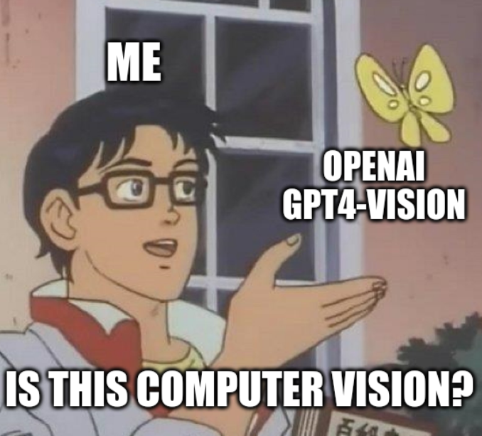

# Sales Slip Scanner NG

> **Scan a receipt. Get the total. Done.**  
> No cloud. No API key. No fees. Just a local vision model doing the work.

From the 2024-version - not right anymore - we run a local vision-model!


---

**Author: Marcel Petrick <mail@marcelpetrick.it>**

**Note: project is generated with AI.**

**License: GPLv3 or later. See `LICENSE`.**

---

## The story

Two years ago I built [a quick proof-of-concept](https://github.com/marcelpetrick/codingWithGPT/tree/master/SalesSlipScanner) that extracted totals from German grocery receipts by sending them to the OpenAI API. It worked — and cost me exactly **15 cents** in API credits for the test run. I wrote it in about an hour and moved on.

Fast forward to 2026: local vision models have caught up. After a systematic benchmark of **10 models** on the same three test receipts, **Qwen3-VL 4B** (3.3 GB, fits comfortably in 8 GB VRAM) hits **100 % accuracy** — completely offline, zero cost per inference, zero data leaving the machine.

This repository is the next generation: the same idea, fully local, properly tested, with a CI pipeline.

---

## What it does

Drop receipt images into `input/`, run the script, and each file is renamed to include its detected total:

```
receipt.jpg  →  receipt_7949.jpg   (79,49 €)
```

A summary with the grand total is printed at the end.

---

## Live output

```
❯ python salesSlipScanner.py
No unprocessed image files found in: .../input/

❯ cp test_images/slip*.jpg input/

❯ python salesSlipScanner.py
Found 3 file(s)  [model: qwen3-vl:4b]

  slip0.jpg … OK  →  slip0_7949.jpg  (79,49 €)
  slip1.jpg … OK  →  slip1_2841.jpg  (28,41 €)
  slip2.jpg … OK  →  slip2_1093.jpg  (10,93 €)

──────────────────────────────────────────────────
  Processed : 3
  Skipped   : 0
  Total     : 118,83 €
──────────────────────────────────────────────────
```

---

## Benchmark

Ten vision models were tested on three annotated German grocery/gas receipts
(ground truth encoded in the filename, e.g. `slip0_7949.jpg` = 79,49 €).
Full results are in [`localVisionModelTest/results.pdf`](localVisionModelTest/results.pdf).

| # | Model | Accuracy | Avg latency | On disk |
|---|-------|----------|-------------|---------|
| 1 | **Qwen3-VL 4B** ← default | **100 %** | 15.3 s | ✓ 3.3 GB |
| 2 | **Llama 3.2-Vision 11B** | **100 %** | 11.5 s | ✓ 7.9 GB |
| 3 | Moondream 2 | 67 % | **0.3 s** | ✓ 1.7 GB |
| 4 | MiniCPM-V 2.6 | 67 % | 5.2 s | ✓ 5.5 GB |
| 5–8 | BakLLaVA / LLaVA-Phi3 / Gemma 3 / German-OCR-3 | 33 % | 1.5–73 s | — |
| 9–10 | SmolVLM2 / LLaVA 1.5 7B | 0 % | — | — |

GPU: NVIDIA RTX A2000 8 GB Laptop GPU.

---

## Prerequisites

- Python 3.10+
- [ollama](https://ollama.com) running locally
- The default model pulled: `ollama pull qwen3-vl:4b`

---

## Setup

```bash
git clone https://github.com/marcelpetrick/sales-slip-scanner-ng.git
cd sales-slip-scanner-ng
pip install -r requirements.txt
ollama pull qwen3-vl:4b
```

---

## Usage

```bash
# Default model (qwen3-vl:4b)
python salesSlipScanner.py

# Override model
python salesSlipScanner.py --model llama3.2-vision:11b
```

If the requested model is not installed, the script prints the exact
`ollama pull` command needed and exits cleanly.

---

## Project layout

```
input/                        ← drop receipt images here
test_images/                  ← annotated reference images
salesSlipScanner.py           ← main script
localVisionModelTest/
  benchmark.py                ← benchmark harness (13 models, pipeline-parallel downloads)
  modelsToTest.md             ← full candidate list with VRAM / disk notes
  results.pdf                 ← one-page ranked results
documents/
  agents.md                   ← working agreement (commit style, pipeline gate)
tests/
  test_sales_slip_scanner.py  ← 65 unit tests, 98 % line coverage
localPipeline.sh              ← lint + tests + coverage — must pass before every commit
requirements.txt
```

---

## Development

Run the full quality pipeline before committing:

```bash
./localPipeline.sh
```

Stages: **dependency install → ruff lint → pytest (98 % coverage, 65 tests)**.
